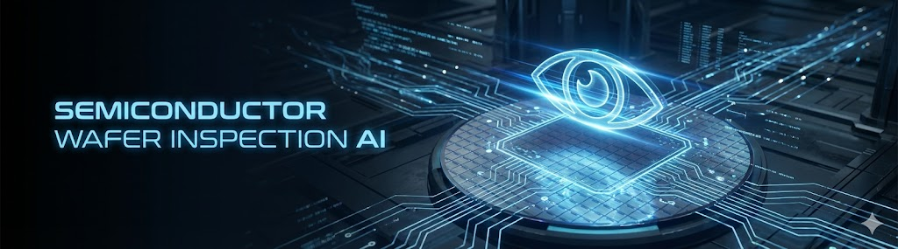
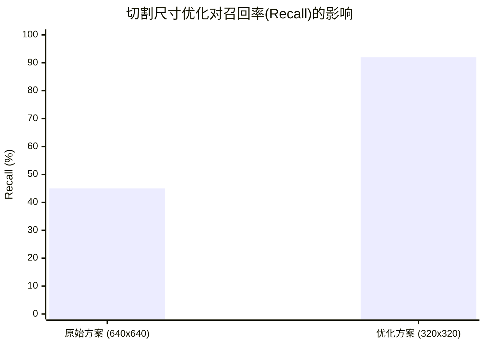
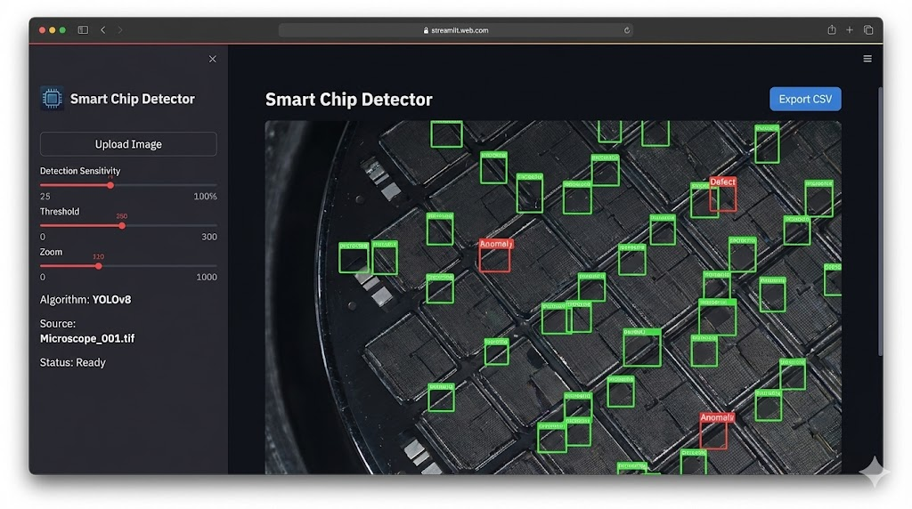

智能芯片自动化视觉检测工具 (Smart Chip Detector)


    ⚠️ Disclaimer / 免责声明

    本项目为本人在 [实习/合作公司名称] 期间开发的核心交付物。

    鉴于商业保密协议 (NDA) 及知识产权保护，本仓库仅包含项目文档、技术架构图及性能复盘，不包含源代码或私有晶圆数据集。 本文档旨在展示本人在 AI 工程化落地、小目标检测优化及桌面端应用封装 方面的技术实践与贡献。

    Note: This repository contains documentation only. Source code and datasets are proprietary and not public due to NDA.

📖 项目背景 (Project Overview)

在半导体制造领域，特定型号晶圆（如 EutecticBond_B60048-30）的传统质检依赖人工镜检，存在效率低、一致性差且易受主观因素影响等痛点 。

本项目旨在开发一套端到端的 AI 视觉检测系统，实现从原始大图输入到缺陷坐标（CSV）输出的全流程自动化 。系统能够精准识别并分类 "合格芯片 (Chip)" 与 "次品芯片 (Bad_Chip)" ，最终交付为无环境依赖的 Windows 桌面应用程序 。

🏗️ 系统架构 (System Architecture)

系统采用 前后端分离 (Decoupled Architecture) 的设计思想 ：


    数据处理层: 针对超大尺寸 BMP 图像，开发了基于重叠切割（Overlap Slicing）的预处理算法。

    推理引擎: 基于云端 GPU 训练的 YOLOv8 模型，负责高精度的目标检测 。

后端逻辑 (backend_yolo.py): 模块化封装了图像切割、模型推理、坐标映射及结果合并算法 。

前端交互 (app_yolo.py): 基于 Streamlit 框架开发，提供参数调节、结果可视化及一键导出功能 。

交付层: 通过 PyInstaller 封装为独立的 .exe 可执行文件 。

🛠️ 技术栈 (Tech Stack)

    核心算法: YOLOv8 (Ultralytics)

    开发语言: Python 3.x

    GUI 框架: Streamlit

    训练环境: 阿里云 PAI-DSW (Tesla V100 GPU) 

    图像处理: OpenCV, NumPy

    打包工具: PyInstaller (Custom Spec & Subprocess execution)
    
## 📂 项目结构 (Project Structure)

虽然源代码未公开，但项目的工程结构如下，展示了模块化设计的理念：

```text
Smart-Chip-Detector/
├── 📂 backend/
│   ├── backend_yolo.py       # [Core] 核心算法库：封装图像切割与推理逻辑
│   ├── utils_slicing.py      # 320x320 重叠切割算法实现
│   └── post_processing.py    # 坐标映射与非极大值抑制(NMS)
├── 📂 frontend/
│   ├── app_yolo.py           # [UI] Streamlit 前端交互逻辑
│   └── components.py         # UI 组件封装
├── 📂 model/
│   └── best.pt               # 云端训练完成的 YOLOv8 权重文件
├── 📂 build_tools/
│   ├── main.py               # [Launcher] 子进程启动脚本 (解决打包问题)
│   └── hook-streamlit.py     # PyInstaller 自定义 Hook 文件
├── requirements.txt          # 项目依赖库
└── README.md                 # 项目文档
```

💡 核心难点与解决方案 (Key Challenges & Solutions)

1. 极小目标检测的“尺寸陷阱” (Small Object Detection)

    问题描述: 在项目初期，直接使用 640x640 的图像切割尺寸进行训练，导致大量微小芯片出现严重漏检（Low Recall）。

深度分析: 经排查，确认为输入图像切片过大，导致芯片在 Feature Map 中的相对像素占比过低，特征被网络忽略 。


解决方案: 提出并验证了**“降维切割”假设**。将切割尺寸从 640x640 调整为 320x320，并同步调整训练参数 (imgsz=320) 。



    成效: 在不增加数据量的情况下，显著提升了模型对小目标的敏感度，漏检率大幅下降。

2. 复杂 AI 应用的单文件交付 (Streamlit Packaging)

    问题描述: 将 Streamlit web 应用打包为 Windows .exe 时，面临极其复杂的依赖问题，包括 PackageNotFoundError、路径错误以及服务器启动时的 404 Not Found 。

解决方案:

    放弃简单的打包方式，编写自定义启动脚本 (main.py)。

    采用子进程 (Subprocess) 方式启动 Streamlit 后台服务，确保环境隔离 。

    定制 .spec 文件，强制包含缺失的元数据与隐式依赖。

成效: 成功生成 ChipDetector.exe，用户无需配置 Python 环境，双击即可在浏览器中运行完整的 AI 系统 。

3. 环境限制与云端迁移 (Cloud Migration)

    问题描述: 本地开发环境面临严格的网络限制及严重的依赖冲突（Python 3.12 vs PyTorch CUDA 版本不兼容）。

解决方案: 果断制定云端迁移策略。利用阿里云 PAI-DSW 平台解决算力与环境瓶颈，在 Tesla V100 上完成了 300 Epoch 的高效训练 。

📊 项目成果 (Deliverables)



    高可用桌面软件: 交付了独立的 ChipDetector 文件夹，包含带图形界面的可视化检测工具 。

高精度模型: 产出了在云端验证过的最佳权重文件 (best.pt) 。

工程化代码: 将脚本式代码重构为可复用的函数库，实现了算法与界面的解耦 。

👨‍💻 个人贡献 (Contribution)

作为项目的独立开发者 (Sole Developer) ，我完成了从 0 到 1 的全链路开发：

    算法攻坚: 独立提出切割尺寸优化方案，解决了核心的漏检问题。

    全栈开发: 编写了从数据清洗、模型训练到前端 UI 的所有代码。

    工程落地: 攻克了 Streamlit 打包的技术难题，实现了真正的商业级交付。

Last Updated: 2025
