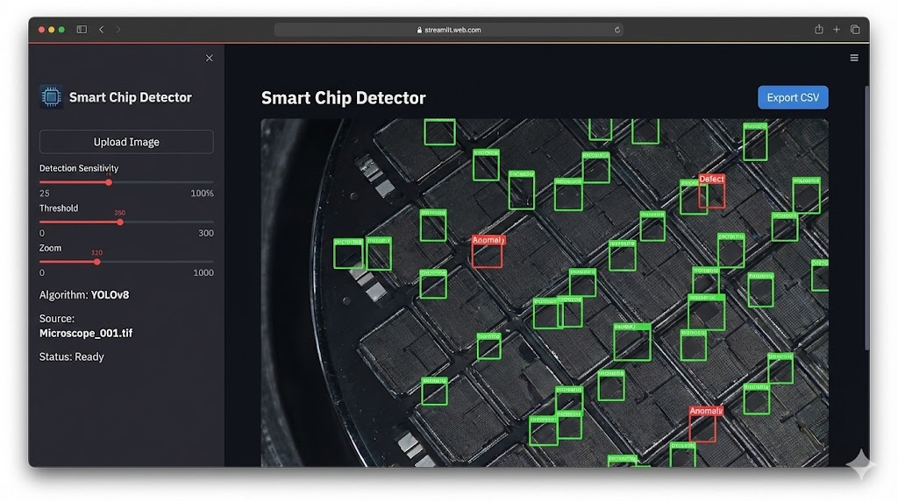
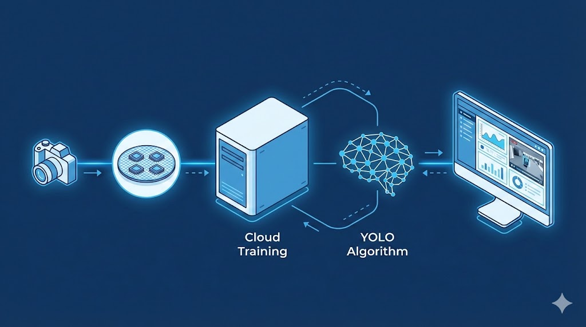

# Wafer Defect Detection System

> 智能晶圆缺陷检测系统 / Industrial-style computer vision prototype

This repository is a public project entry for a wafer / chip defect detection prototype. It documents the system idea, visual workflow, interface direction, and engineering lessons around small-object detection and local delivery.

## Portfolio Case Study

Read the public case study here:

[Wafer Defect Detection case study](https://eric-portfolio-weld.vercel.app/#wafer-case-study)

## Preview



## What This Project Explores

- Small-target defect detection with a YOLOv8-style workflow.
- A Streamlit-style interface for image upload, parameter tuning, result preview, and CSV export.
- A cloud-to-local workflow: training or experimentation on cloud GPU resources, then preparing a Windows-friendly local demo.
- Practical AI application thinking beyond a single model-training script.

## Public Boundary

This repository is intentionally documentation-first.

Public:

- Project overview and system architecture.
- UI and architecture visuals.
- High-level implementation notes.
- Dependency notes.

Not public:

- Proprietary source code.
- Private wafer images or industrial datasets.
- Production validation details.
- Client or company confidential information.

The project should be read as a prototype / learning project, not as a production inspection system.

## System Architecture



The prototype can be understood as four layers:

1. **Image preparation**: large wafer or chip images are prepared for detector-friendly inference.
2. **Detection model**: YOLOv8 is used as the core detection direction.
3. **Application interface**: Streamlit-style UI wraps inference into an inspectable workflow.
4. **Local delivery**: the target delivery direction is a Windows-local demo rather than a notebook-only result.

## Repository Assets

| File | Purpose |
| --- | --- |
| `ui_demo.png` | Interface preview for the inspection workflow |
| `architecture_diagram.png` | High-level system architecture |
| `WAFER_INSPECTION.png` | Domain visual for wafer / chip inspection |
| `requirements.txt` | Reference dependency list |

## Quickstart

This public repository does not include runnable source code because the original project contains private implementation details and data.

To inspect the public materials:

```bash
git clone https://github.com/Fiksy9790707/Wafer-Defect-Detection-System.git
cd Wafer-Defect-Detection-System
```

Then open:

- `README.md`
- `ui_demo.png`
- `architecture_diagram.png`
- `WAFER_INSPECTION.png`

## Tech Stack

- Python
- YOLOv8 / Ultralytics
- Streamlit
- OpenCV / NumPy
- Aliyun PAI
- PyInstaller-oriented local delivery

## Current Limitations

- No public source code or dataset is included.
- Public metrics are intentionally not emphasized unless they can be verified from reproducible materials.
- The current public version is best used to understand the workflow and engineering direction.
- A real demo GIF or runnable sample would make the repository easier to evaluate later.

## Future Improvements

- Add a short demo GIF using non-sensitive sample images.
- Add sanitized sample input/output examples.
- Document a reproducible toy version if a public dataset becomes available.
- Add clearer notes on local packaging and environment constraints.

## Author

Eric / 冯学诚<br>
Computer Science undergraduate at Harbin Institute of Technology, Shenzhen<br>
Portfolio: https://eric-portfolio-weld.vercel.app/
